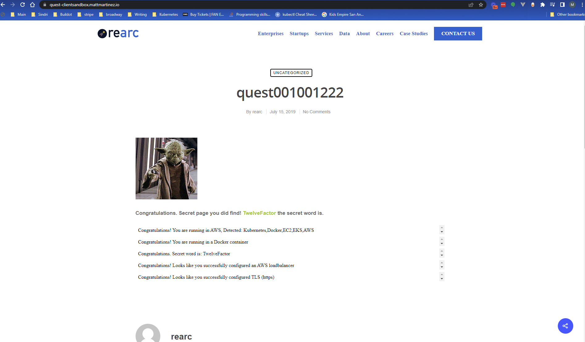

# Quest challenge

## Introduction
Thanks for allowing me to tackle a fun challenge! The goal was to deploy a containerized solution into one or more 
public clouds and meet several goals around TLS, load balancing, secrets management, etc.
These were my goals in addressing this challenge:
- Fulfill the minimum technical stack to satisfy your requirements
- Make the stack easy to understand
- Make the stack simple to extend
- Make the stack simple to scale

The reason I aimed for these goals was to show that I try to value a balance between:
- Not allowing too much scope creep in a new project, and
- Still spending enough time to prepare a project to be easily inherited by other engineers

## Terraform Directory Structure
Terraform resources are split into multiple stacks. The goal is to make it easy to mix modules to create customizable
environments while keeping stack size low.

All Terraform state is saved in a shared S3 backend bucket in a central AWS account, to easily import data between stacks when needed.

### account
Deploys resources that could reasonably be expected to be applied in each AWS account. This includes:
- all networking resources needed
- a log group for VPC flow logs
- a KMS key to encrypt the log group.

### eks_environment
Deploys resources that could reasonably be expected to be needed to host one or more services in AWS EKS. Included are:
- An EKS cluster and node group
- IAM roles for:
  - the EKS cluster
  - the node group
  - an optional AWS Load Balancer Controller add-on for EKS
- An OIDC provider for kubernetes service accounts

### quest
Deploys quest-specific resources:
- ACM certificate for the AWS ALB listener
- EKS task role and OIDC provider
- ECR repository

### dns
- Route 53 record for quest, pointing to the load balancer created by Kubernetes

## Kubernetes Directory Structure
Kubernetes resources are split into two Helm charts.

### bootstrap
This chart deploys resources that can be shared across multiple kubernetes services:
- A service account for the AWS Load Balancer Controller add-on
- The AWS Load Balancer Controller add-on itself

### app
This chart deploys all resources required to host quest in EKS:
- Service accounts for the quest deployment
- A pod, deployment and service for quest
- An ingress resource for the AWS Load Balancer Controller
- Basic secrets management required for this challenge

## How to deploy
### What to run
Although it's not required, a convenience script is provided: `infrastructure/bin/deploy ${name_of_workspace}`. This will handle the provisioning of all resources needed for the app.

### What it does
The script and all IaC in this project assume a multi-account AWS setup. The ${workspace} variable passed corresponds to an AWS
profile. It also becomes the name of the workspace in the Kubernetes cluster used to host the app. The script performs
these steps in order:
- Check prerequisites for the script
  - Checks that a workspace is passed
  - Checks that the workspace corresponds to an AWS profile
  - Checks that required tools are installed:
    - the AWS CLI
    - kubectl
    - helm
- Applies an `account` Terraform stack
- Applies an `eks_environment` Terraform stack
- Applies a `quest` Terraform stack
- Saves needed Terraform outputs, to be able to pass them to kubernetes
- Configures kubectl to point to the newly-created AWS EKS cluster
- Installs the bootstrap Helm chart to the EKS cluster
- Installs the quest Helm chart to the EKS cluster
- Applies a `dns` Terraform stack

## Given more time, I would improve...
If I either had more time, or this was a real-world project and needed to get fleshed out and delivered, I'd:

- discuss making the Terraform modules directory its own git repository
- add a system for customizing decrypt access to KMS keys
- ask if a multi-account setup is ok, and if not, update naming conventions in Terraform to prevent clashes in a single
  account
- set more variables with defaults in the Terraform modules, to allow customization while still enforcing best practices
- retool the helm chart to work well in a local environment
- have a more official system for bootstrapping an EKS cluster with ALB ingress controller resources. Right now a
  bootstrap chart is hosted in this repository, but ideally it would live elsewhere
- clean up the Helm charts to not have values and helper info they don't need. Right now they're close to default charts
- add a secrets management solution for kubernetes
- add CI/CD to the quest app
- discuss adding testing or abstraction to the Terraform layer, possibly something like Atlantis
- Add autoscaling, both for the quest deployment in kubernetes and for the EKS node group
- Add a better logging solution for the quest app, either through AWS Cloudwatch or a third-party logging service
- Add monitoring and alarms around the quest service and underlying infrastructure

## Proof
